# Reusable Modules - Its as easy as ABI

I recently gave a lighning talk at Kotlin London. This is a Kotlin that was hosted at the Marks & Spencer offices (I work there!).

I gave a talk aimed at helping other developers think about reusable modules. I aimed to give some context about Kotlin & Gradle and then tie it together on the topic of ABIs.

[Here are the slides in PDF form](images/presentations/easy-as-abi.pdf).

Slides:

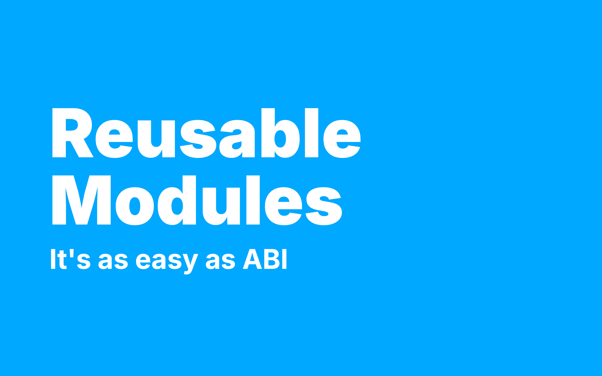

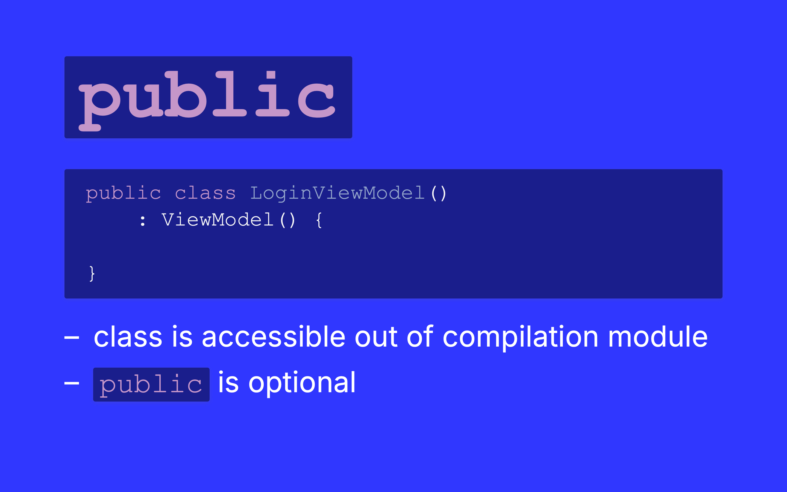

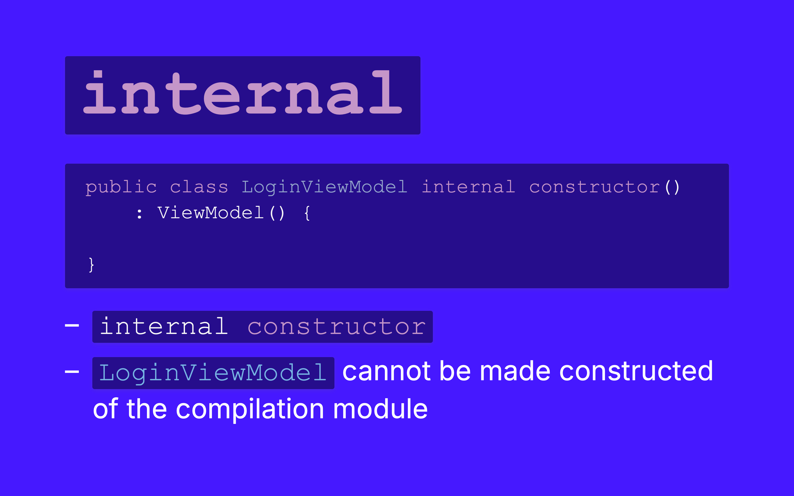

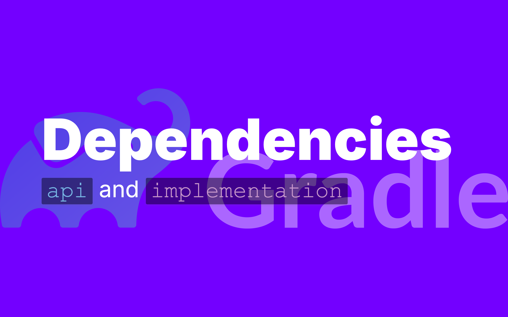

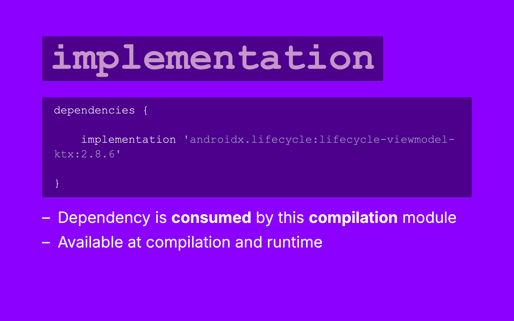

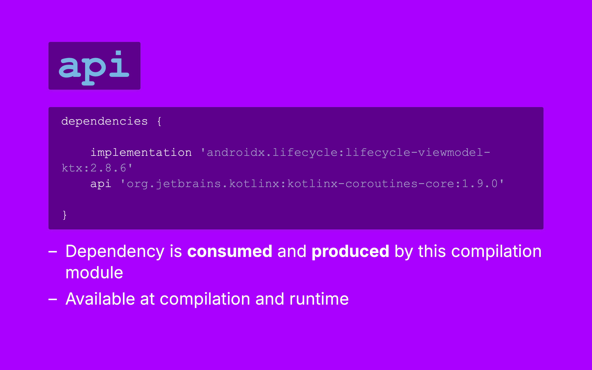

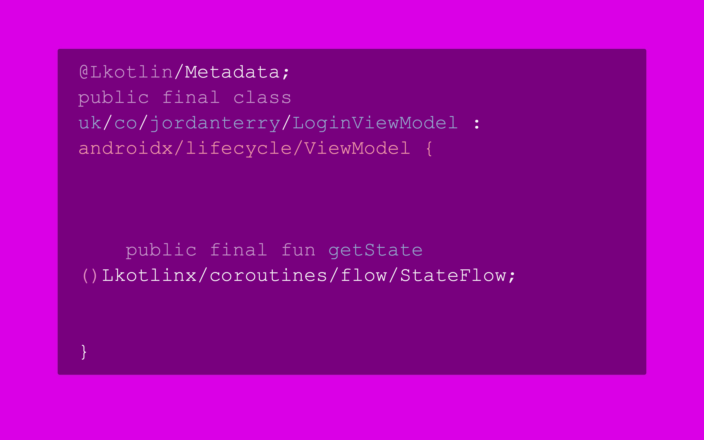

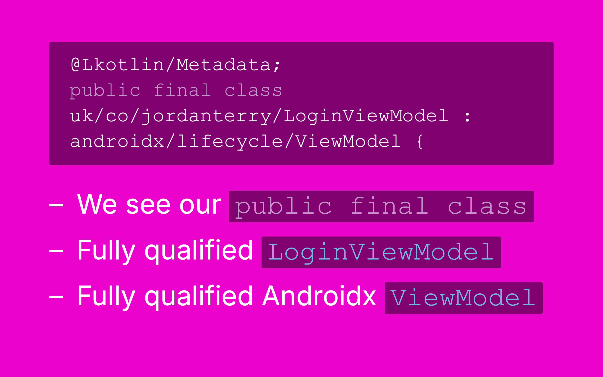

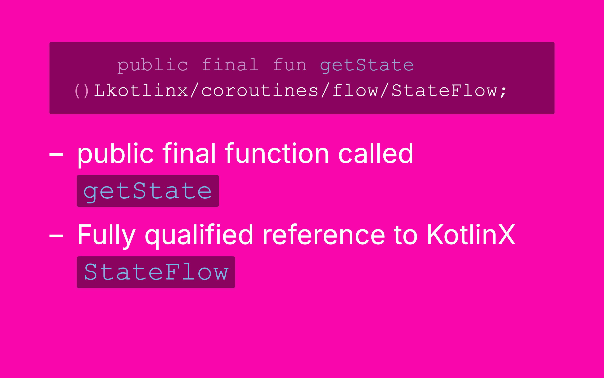

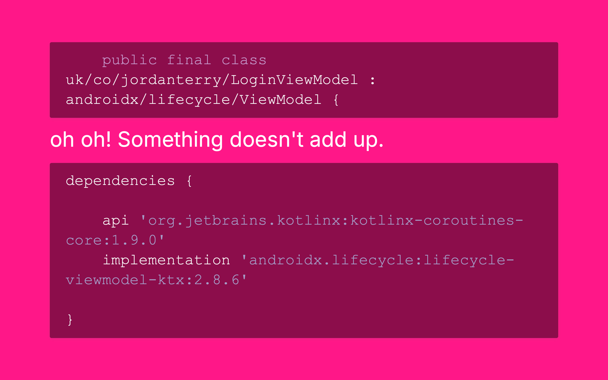

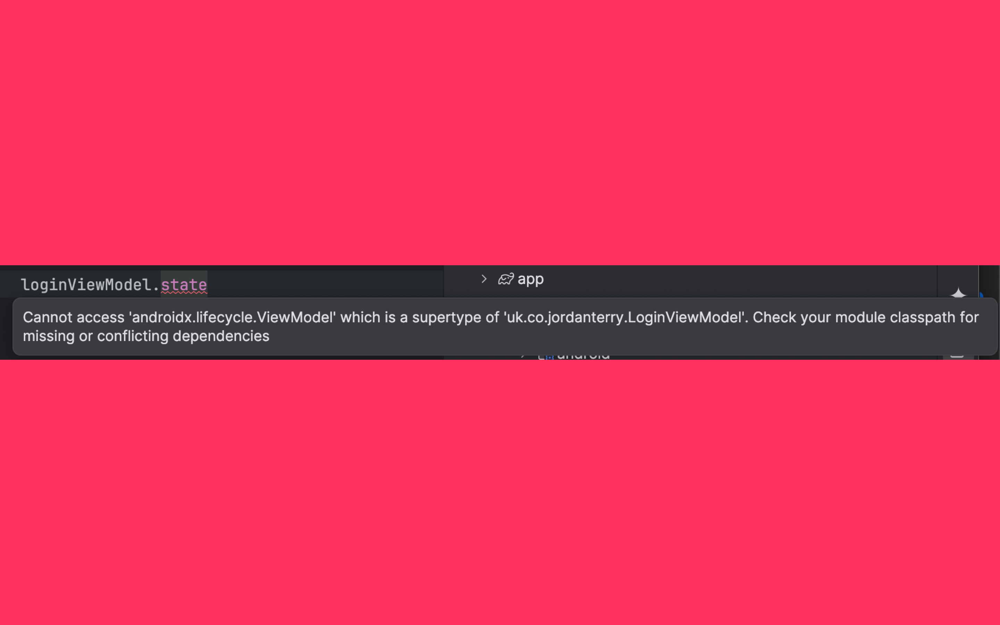

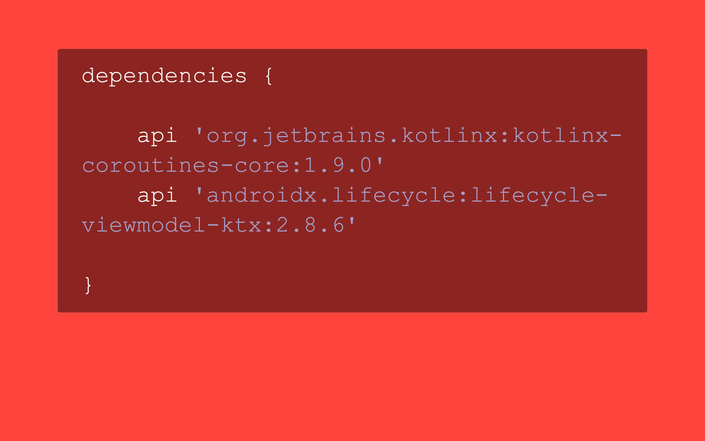

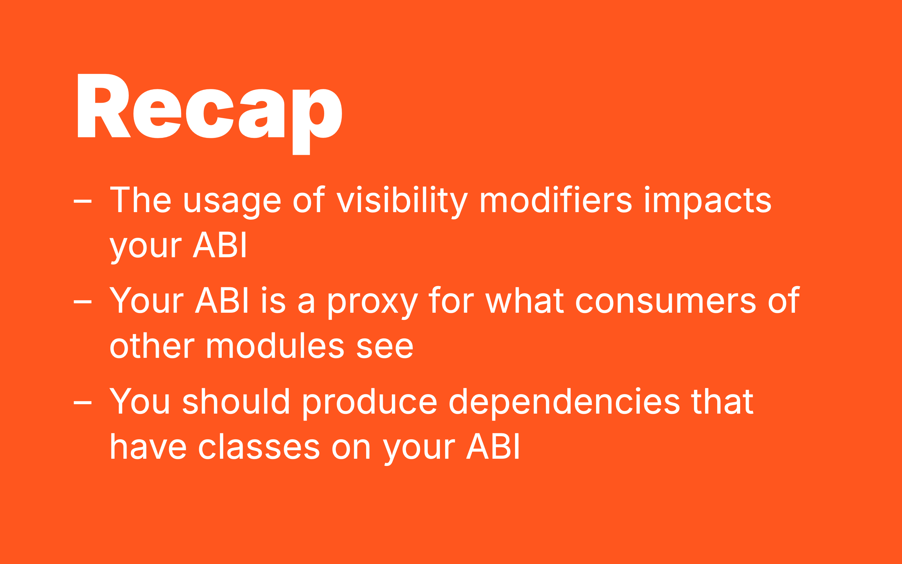

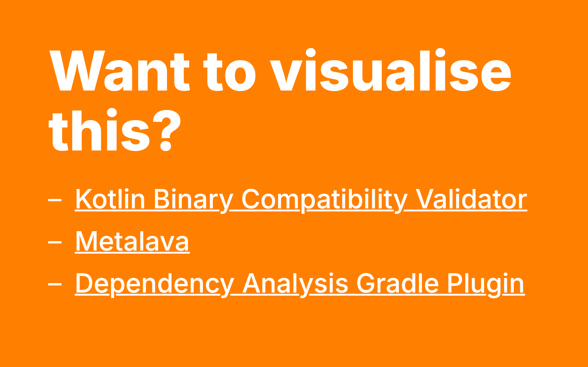

